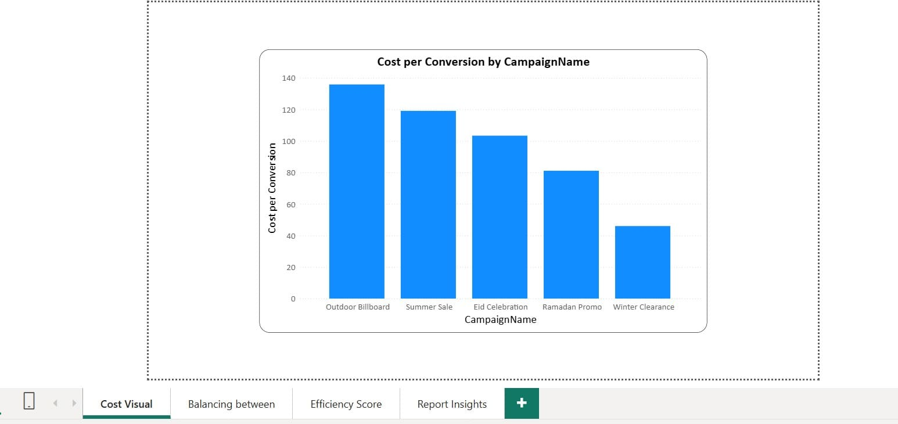
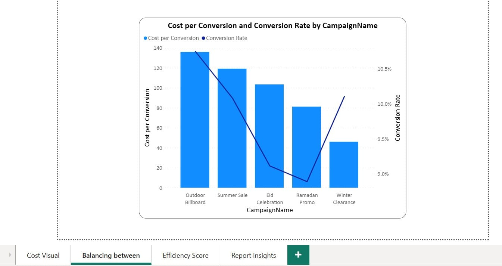
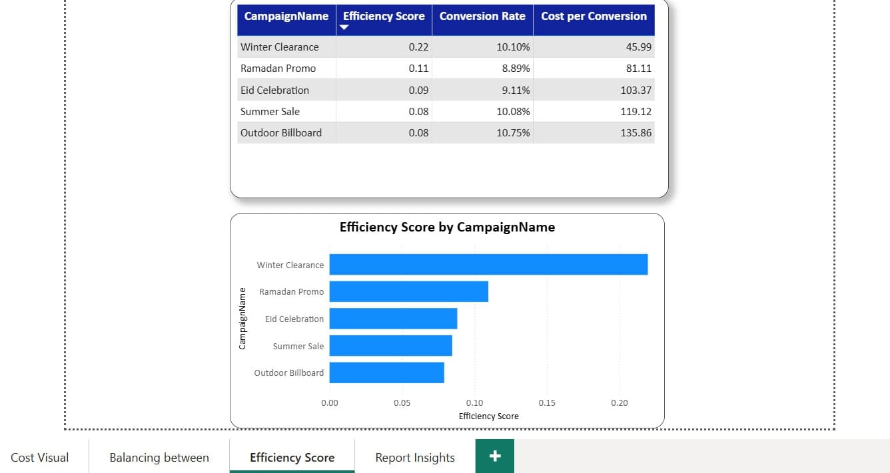
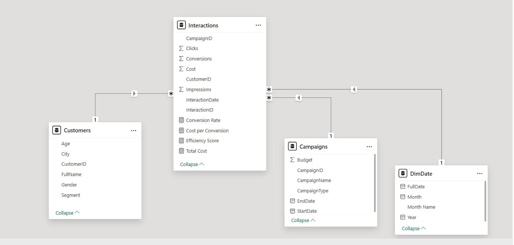

## 📊 Marketing Campaign Performance & Customer Behavior – Power BI

Analyze marketing campaign efficiency and customer engagement to uncover high-performing campaigns, customer segments, and data-driven optimization opportunities.

## 📌 Overview

This Power BI project analyzes a multi-channel marketing campaign dataset to evaluate campaign performance and customer behavior using realistic business metrics.

The dashboard answers key marketing questions such as:

Which marketing campaign delivers the best balance between conversion rate and cost?

How efficiently is marketing budget converted into customer actions?

Which customer segments show stronger engagement with campaigns?

How can marketing strategies be optimized based on performance insights?

## 🔍 Key Insights
1️⃣ Campaign Efficiency Analysis

One campaign clearly outperforms others based on a balanced combination of high Conversion Rate and low Cost per Conversion.

The top-performing campaign does not rely on a single strong metric, but rather maintains consistent efficiency across multiple KPIs.

This balanced performance makes the campaign more scalable and sustainable compared to others.

2️⃣ Conversion Rate vs Cost Trade-off

Campaigns with high Conversion Rates are not always the most cost-efficient.

Some campaigns achieve strong engagement but at a significantly higher cost per conversion.

An Efficiency Score was introduced to objectively rank campaigns based on both effectiveness and cost control.

3️⃣ Data-Driven Campaign Ranking

Campaigns were ranked from best to worst using a composite efficiency metric.

This ranking enables clear prioritization of campaigns for future investment and optimization.

## 🛠 Tools & Skills

Power BI Desktop

Power Query

DAX (Measures & KPIs)

Data Modeling

Marketing Performance Analysis

## 📂 Dataset

Dim-Customers

Dim-Campaigns

Fact-Interactions

All data tables are included in the `Dataset` folder as an Excel file.

## 📷 Dashboard Preview

Here are screenshots of the dashboard:

## 📦 Full Project

The complete Power BI project file is available as: `Marketing_Campaign_Performance.pbix `

